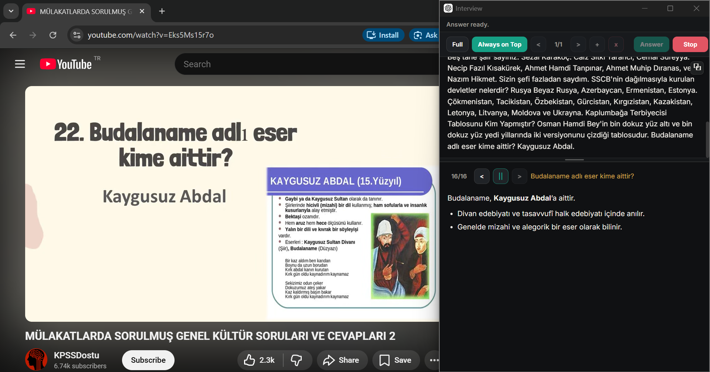

# Interview

Interview is a compact Tauri desktop assistant for live interview sessions. It captures speaker and microphone audio, transcribes speech in real time with [Deepgram](https://deepgram.com), detects interviewer questions, and generates concise answers through ChatGPT.

Chrome Extension -> https://github.com/barissandbox/ChatGPTInterview




---

## Install

1. Download the latest release for your platform from [Releases](https://github.com/barissandbox/Interview/releases/latest).
2. Install or extract the package.
3. Run **Interview**.

## Development

#### Prerequisites

- [Rust](https://rustup.rs/) (stable)
- Platform build tools (Visual Studio Build Tools on Windows)

```bash
git clone https://github.com/barissandbox/Interview.git
cd Interview

cd frontend
npm install
npm run build
cd ..

cargo run
```

## License

MIT
